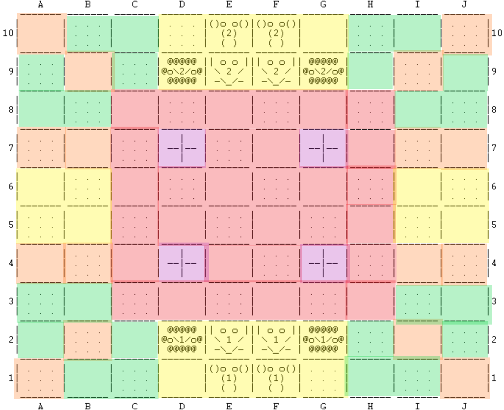

# PFL 22/23 - Trabalho Prático 2

## Identificação do trabalho

### Jogo: Barca

### Grupo: (Barca_2)

- 202005358 - Alexandre Ferreira Nunes
- 202004907 - Gonçalo da Costa Sequeira Pinto
- 202005285 - Guilherme António Cerqueira Magalhães

## Instalação e Execução

Deve garantir que tem instalado o SICStus Prolog na versão 4.7.1.

De seguida, basta abrir o SICStus e consultar o ficheiro `proj.pl`

Para começar um jogo deve inserir o predicado:

```prolog
| ?- play.
```

## Descrição do jogo

O jogo desenrola-se em um tabuleiro de damas 10x10 com três tipos de peças animais que se movem como a rainha, o bispo e a torre no xadrez. (elefante, leão e rato respetivamente)

Duas características distintivas do jogo são:
- Ausência de captura
- Domínio pedra-papel-tesoura entre os três tipos de peças
  
Cada jogador controla seis animais, dois de cada tipo, e o objetivo do jogo é ocupar três das quatro casas objetivo que estão localizados perto do centro do tabuleiro.

Os animais de um jogador são amigáveis entre si, o que significa que eles podem ocupar quadrados adjacentes um ao outro. 

No entanto, em relação a animais de jogadores distintos, o rato teme o leão, o leão teme o elefante e o elefante teme o rato.

Um animal não pode se mover para um quadrado, nem permanecer permanentemente em um quadrado adjacente a um animal que ele teme (com exceção de um animal "preso").

Um animal diz-se preso quando está assustado e não pode realizar nenhuma jogada que o permita não continuar assustado.

O jogador é obrigado a mover animais assustados.

## Lógica do jogo

### Representação interna do estado do jogo

O estado do jogo é representado `dinamicamente` com os seguintes predicados:

```prolog
playerType/2
board/1
playerTurn/1
evaluationType/2
num_turn/1
targetPosition/2
```

- `playerType(+Player, -Type)`:

Indica o tipo do jogador.

Os jogadores são representados por:

0. Player 1
1. Player 2

Os tipos podem ser:

0. Human
1. Random Bot
2. Greedy Bot
3. MinMax Bot

Exemplos de uso:

```
playerType(0, 0) % O player 1 é human?
playerType(1, 2) % O player 2 é greedy?
```

Este predicado é utilizado para possibilitar uma interface de turnos generalizada e consistente.

---

- `board(-Board)`:

Unifica a variável Board com o tabuleiro atual do jogo.

O tabuleiro é representado como uma lista de listas.

Exemplo de um tabuleiro:

```prolog
[
    [0, 0, 0, 0, 4, 4, 0, 0, 0, 0],
    [0, 0, 0, 6, 5, 5, 6, 0, 0, 0],
    [0, 0, 0, 0, 0, 0, 0, 0, 0, 0],
    [0, 0, 0, 7, 0, 0, 7, 0, 0, 0],
    [0, 0, 0, 0, 0, 0, 0, 0, 0, 0],
    [0, 0, 0, 0, 0, 0, 0, 0, 0, 0],
    [0, 0, 0, 7, 0, 0, 7, 0, 0, 0],
    [0, 0, 0, 0, 0, 0, 0, 0, 0, 0],
    [0, 0, 0, 3, 2, 2, 3, 0, 0, 0],
    [0, 0, 0, 0, 1, 1, 0, 0, 0, 0]
].
```

Os possíveis valores em cada posição do tabuleiro são:

0. No Piece
1. Elephant (Player 1)
2. Mouse (Player 1)
3. Lion (Player 1)
4. Elephant (Player 2)
5. Mouse (Player 2)
6. Lion (Player 2)
7. Target
8. Possible Move
9. Previous Position

---

- `playerTurn(+Player)`:

Verifica se é a vez de o Player (0/1) jogar.

---

- `evaluationType(+Player, +EvaluationType)`:

Verifica que tipo de **evaluate** o jogador está a usar.

---

- `num_turn(-Num)`:

Unifica a variável **Num** com o número do turno.

Este predicado foi adicionado devido a um problema relacionado com a natureza do computador greedy.

Ele permite terminar a partida em **Empate** se o número de turnos atingir os 50.

Mostra-se de seguida uma imagem do problema:

<div align="center">
    
</div>

O jogo a partir de aqui vai entrar de loop de movimentos devido a natureza do `greedy` e do `próprio jogo`!

O elefante que está no objetivo está assustado devido ao rato presente no centro do tabuleiro.

O jogador é então obrigado a mover o elefante e o algoritmo greedy `corretamente` irá mover o elefante para o objetivo de cima. Não move para o objetivo da esquerda pois daria um tabuleiro com pior valor, visto que retirava valor às peças do mesmo quadrante.

Na vez do outro jogador, o algoritmo greedy tem oportunidade de retirar o mesmo elefante do objetivo e mexe o rato para perto dele.

Novamente, o jogador é então obrigado a mover o elefante e mais uma vez se irá mover para outro objetivo.

E o rato vai atrás e entra-se num loop da caça do rato ao elefante.

Este problema é muito específico e acontece quando:
- Existe um rato nos 4 quadrados centrais
- Um elefante num objetivo com possibilidade ir para outro objetivo diretamente
- Não existe nenhum outro movimento de outra peça que permita igualar o valor do tabuleiro

De realçar que os movimentos são de facto os melhores e o algoritmo greedy está a se comportar como devia.

---

- `targetPosition(+X, +Y)`:

Indica as **casas objetivos**

### Visualização do estado de jogo

O código relacionado com a visualização do estado do jogo está no ficheiro `view.pl`.

O predicado principal é:

```prolog
display_game(Board) :- 
    drawHeader,
    drawRowLoop(10, Board),
    drawFooter,
    !.
```

Sendo intuitivo o funcionamento high-level.

Cada posição do tabuleiro é um quadrado 3x3, portanto o desenho de uma linha do tabuleiro corresponde a 3 linhas de output, sendo cada peça dividida em 3 partes.

Ou seja, o desenho de uma linha do tabuleiro vai ser:

```prolog
drawRow(Index, Row) :-
    drawLine(Index, Row, 1),
    drawLine(Index, Row, 2),
    drawLine(Index, Row, 3).
```

A tradução dos valores do tabuleiro para as peças é realizada no seguinte predicado:

```prolog
drawPlace(+Piece, +Offset, +Color).
```

Sendo `Piece` o valor do tabuleiro; `Offset` a parte da peça; `Color` cor da posição

Exemplo - Desenho do elefante:

```prolog
drawPlace(1, 1, _) :- write('()o o()|').
drawPlace(1, 2, _) :- write('  (1)  |').
drawPlace(1, _, _) :- write('  ( )  |').
drawPlace(4, 1, _) :- write('()o o()|').
drawPlace(4, 2, _) :- write('  (2)  |').
drawPlace(4, _, _) :- write('  ( )  |').
```

As peças não diferem consoante a cor mas este parâmetro permite desenhar lugares vazios de uma forma mais clara e bonita:

```prolog
drawPlace(0, _, 0) :- write('       |').
drawPlace(0, _, 1) :- write(' . . . |').
```

A cor é calculada com o Index da coluna:

```prolog
Color is Index mod 2
```

Tabuleiro inicial:

<div align="center">
    
</div>

<div align="center" style="margin: 1em">
    <strong>Nota:</strong>
</div>

```
A seguinte posição corresponde a uma casa objetivo.

 ------- 
|   |   |
| --|-- |
|   |   |
 ------- 
```

Tabuleiro durante o jogo:

<div align="center">
    
</div>

<div align="center" style="margin: 1em">
    <strong>Nota:</strong>
</div>

```
A seguinte posição corresponde à posição anterior da peça que se moveu mais recentemente.

Torna mais claro qual a peça que se mexeu no turno.

 ------- 
|~~~~~~~|
|~~~~~~~|
|~~~~~~~|
 ------- 
```

Também implementamos uma feature de permite o jogador observar os possíveis movimentos que pode realizar depois de selecionar uma peça. Permite que o utilizador observe movimentos inválidos que possam não ser obvios.

Exemplo complexo de movimentos do elefante na posição `E6`:

<div align="center">
    
</div>

<div align="center" style="margin: 1em">
    <strong>Nota:</strong>
</div>

```
A seguinte posição corresponde a uma jogada VÁLIDA.

 ------- 
|XXXXXXX|
|XXXXXXX|
|XXXXXXX|
 ------- 
```

---

Em relação ao input ....

....

....

....

....

....

....

....

### Execução de Jogadas

A imagem seguinte permite ver um diagrama com a estrutura high level do algoritmo de execução das jogadas.

<div align="center">
    
</div>

- Qual a distinção entre o `turn` e o `turnAction`?

O turn é responsável por analisar o board e verificar se o jogador tem peças assustadas e calcula as peças que ele pode jogar no turno. 

```prolog
% Test if player has scared pieces
% If yes, he needs to play them
turn(Board, Player) :-
    findScaredPieces(Board, Player, ScaredPieces),
    ScaredPieces  = [_|_],
    turn_action(Board, Player, ScaredPieces),
    !.
% Otherwise, play a normal turn
turn(Board, Player) :-
    validPieces(Board, Player, Pieces),
    turn_action(Board, Player, Pieces).
```

O turnAction recebe as peças que é obrigado a jogar como argumento e dependendo do tipo do jogador irá chamar o predicado respetivo.

```prolog
% If Player is Human
turn_action(Board, Player, PiecesToMove) :-
    playerType(Player, 0),
    turn_human(Board, Player, PiecesToMove).

% If Player is Random
turn_action(Board, Player, PiecesToMove) :-
    playerType(Player, 1),
    turn_random(Board, Player, PiecesToMove).

% If Player is Greedy
turn_action(Board, Player, PiecesToMove) :-
    playerType(Player, 2),
    turn_greedy(Board, Player, PiecesToMove).

% If Player is Greedy (MinMax)
turn_action(Board, Player, PiecesToMove) :-
    playerType(Player, 3),
    turn_greedy_minmax(Board, Player, PiecesToMove).
```

Por fim tem então a lógica do turno de cada jogador: turn_human, turn_random, turn_greedy, turn_minmax.

Iremos analisar o turn_human e os restantes irão ser analisados na Secção **Jogadas do Computador**:

```prolog
% Handle Human Turn
turn_human(Board, Player, PiecesToMove) :-
    readPosition(X, Y, Piece, Board, Player, PiecesToMove),
    visualize_moves(X, Y, Piece, Board, Player, Moves),
    readDestination(XF, YF, Moves, Player),
    movePiece(X, Y, XF, YF, Board, NewBoard),
    !,
    setBoard(NewBoard).
```

- `readPosition` - Irá ler do input uma posição válida
- `visualize_moves`- Irá desenhar no ecrã os movimentos válidos que o jogador pode realizar
- `readDestination` - Irá ler do input uma posição válida
- `movePiece` - Alterar o board atual
- `setBoard` - Altera o board armazenado dinamicamente

### Lista de Jogadas Válidas

Na nossa implementação o predicado `valid_moves` não faz sentido e não seria utilizado. Nós fizemos a lógica do jogo duma forma que a cada turno os predicados recebem as peças que o jogador é **obrigado** a jogar, e baseado nessas peças é que depois calculamos os movimentos válidos.

Optamos por essa solução visto que satisfaz facilmente uma regra do jogo que é: um jogador com peças assustadas, é obrigado a jogar uma delas. Além disso permite uma interface generalizada de turnos.

De qualquer forma, implementados o predicado embora não seja usado:

```prolog
flatten([], []).
flatten([XI-YI-Moves|T2], Flat) :-
    flattenAux(XI-YI, Moves, Flat2),
    flatten(T2, Flat3),
    append(Flat2, Flat3, Flat).

flattenAux(_, [], []).
flattenAux(XI-YI, [XF-YF|T], [XI-YI-XF-YF|T2]) :-
    flattenAux(XI-YI, T, T2).

valid_moves(Board, Player, Moves) :-
    findall(X-Y-M, (backtrackGetPiece(X, Y, Board, Piece), playerPiece(Piece, Player), getMoves(X, Y, Piece, Board, Player, M)), MovesAux),
    flatten(MovesAux, Moves).
```

O resultado do `findall` será uma lista com este aspeto:

[XDaPeça-YDaPeça-[XMov1-YMov1, XMov2-YMov2, XMov3-YMov3], ...]

Para ter um lista limpa de movimentos implementou-se o predicado `flatten` que vai transformar a lista acima para:

[XDaPeça-YDaPeça-XMov1-YMov1, XDaPeça-YDaPeça-XMov2-YMov2, XDaPeça-YDaPeça-XMov3-YMov3, ...]

---

Em relação então ao nosso predicado `getMoves` usado é o seguinte:

```
getMoves(X, Y, P, Board, Player, Moves) :-
    mouse(P),
    expand_up_down(X, Y, Board, Player, P, Moves),
    !.
getMoves(X, Y, P, Board, Player, Moves) :-
    lion(P),
    expand_diagonal(X, Y, Board, Player, P, Moves),
    !.
getMoves(X, Y, P, Board, Player, Moves) :-
    elephant(P),
    expand_up_down(X, Y, Board, Player, P, Moves1),
    expand_diagonal(X, Y, Board, Player, P, Moves2),
    append(Moves1, Moves2, Moves),
    !.
```

De forma a tornar esta operação simples e eficiente implementou-se um `algoritmo de expansão` onde a partir de uma posição o algoritmo expande numa direção e adiciona as novas posições até encontrar o fim do tabuleiro ou alguma peça pelo meio.

Este algoritmo permite logo resolver o problema de as peças poderem passar por cima duma das outras.

#### Implementação do algoritmo de expansão:

As peças podem expandir no máximo em 8 direções.

- O predicado `expand_cross` trata das direções horizontais e verticais.
- O predicado `expand_diagonal` trata das direções na diagonal.

Ambos os predicados acima utilizam o predicado `expand`.

```prolog
expand(+X, +Y, +StepX, +StepY, +Board, +Player, +Piece, -Moves).
```

Que tem como argumentos:
- A posição atual (X,Y)
- A direção da expansão (StepX, StepY)
- O tabuleiro atual (Board)
- O Jogador da peça que está a expandir (Player)
- A peça que está a expandir (Piece)

```
É recebido o Player e a Piece para permitir calcular se a peça fica assustada com um movimento, em caso afirmativo o movimento é inválido.
```

E unifica a variável Moves com os movimentos calculados.

A implementação do predicado `expand` é simples visto que chama outro predicado com um acumulador.

```prolog
expand(X, Y, StepX, StepY, Board, Player, Piece, Moves) :-
    X1 is X + StepX,
    Y1 is Y + StepY,
    expand_acc(X1, Y1, StepX, StepY, Board, Player, Piece, [], Moves).
```

O cálculo de X1 e Y1 permite ignorar a posição atual da peça.

Por fim, o predicado `expand_acc` vai somando StepX e StepY às variáveis X e Y e verifica se o movimento é válido.

```prolog
% Verifica os limites do tabuleiro
expand_acc(0, _, _, _, _, _, _, Acc, Acc).
expand_acc(11, _, _, _, _, _, _, Acc, Acc).
expand_acc(_, 0, _, _, _, _, _, Acc, Acc).
expand_acc(_, 11, _, _, _, _, _, Acc, Acc).

% Verifica se a posição está ocupada
expand_acc(X, Y, _, _, Board, _, _, Acc, Acc) :-
    getPiece(X, Y, Board, Piece),
    \+empty(Piece).

% Verifica se o movimento torna a peça assutada
expand_acc(X, Y, StepX, StepY, Board, Player, Piece, Acc, Result) :-
    isScared(X, Y, Board, Player, Piece),
    X1 is X + StepX,
    Y1 is Y + StepY,
    expand_acc(X1, Y1, StepX, StepY, Board, Player, Piece, Acc, Result).

% Caso contrário, é um movimento válido
expand_acc(X, Y, StepX, StepY, Board, Player, Piece, Acc, Result) :-
    A1 = [X-Y|Acc],
    X1 is X + StepX,
    Y1 is Y + StepY,
    expand_acc(X1, Y1, StepX, StepY, Board, Player, Piece, A1, Result).
```

### Final do Jogo

O final do jogo é detetado verificando se algum jogador possui mais de 2 peças nas casas objetivos.

O enunciado pede um game_over/2 que recebe o GameState mas sendo que nós guardamos o estado do jogo dinâmicamente o nosso predicado tem aridade 1.

```prolog
game_over(Winner) :-
    board(Board),
    getTargetPieces(Board, Pieces),
    gameOverWinner(Pieces, Winner).

% gameOverWinner(P1, P2, P3, P4, Winner)
gameOverWinner(Pieces, 1) :-
    getPlayerPoints(Pieces, 0, 0, Points),
    Points > 2,
    !.
gameOverWinner(Pieces, 2) :-
    getPlayerPoints(Pieces, 1, 0, Points),
    Points > 2,
    !.
gameOverWinner(_,3).
```

- `game_over` - Vai buscar o tabuleiro dinâmico (Board) e as peças que estão nas casas objetivo (Pieces) e chama o predicado gameOverWinner
- `gameOverWinner` - Verifica se pelo menos 3 peças pertencem a um jogador

Separou-se em dois predicados `game_over` e `gameOverWinner` para evitar repetir o cálculo de ir buscar as peças nas casas objetivo.

### Avaliação do Tabuleiro

Existe dois predicados de avaliação do tabuleiro.

No início de cada jogo é pedido ao utilizador para indicar o tipo de evaluate que pretende utilizar.

<div align="center">
    
</div>

#### Avaliação "Simple"

Este foi o primeiro **evaluate** que fizemos sendo o mais simples.

A avaliação tem como principal fator o número de pontos que o Player tem.

Com pontos quer-se dizer com número de casas objetivo dominadas.

Além dos pontos é avaliado o número de peças assutadas que o outro jogador tem, dando mais ênfase nas peças assustadas nos objetivos.

Esta última verificação é essencial, sem ela o bot não tentaria retirar as peças do outro jogador das casas objetivo.

```prolog
value_simple(Board, Player, Value) :-
    % Evaluate objectives
    getTargetPieces(Board, TargetPieces),
    getPlayerPoints(TargetPieces, Player, 0, Points),
    % Evaluate Pieces
    OtherPlayer is 1 - Player,
    findScaredPieces(Board, OtherPlayer, ScaredOtherPlayer),
    numScaredOnTarget(ScaredOtherPlayer, 0, ScaredOnTarget),
    length(ScaredOtherPlayer, NumScaredOtherPlayer),
    % Formula
    Value is -100 * Points - 50 * ScaredOnTarget - NumScaredOtherPlayer.
```

#### Avaliação "Complex" - Código no ficheiro AI.pl

Esta avaliação continua a ter em consideração o número de pontos do player (apesar de ser calculada de outra forma) e o número de peças do outro player assustadas que é essencial para uma boa jogabilidade.

O que difere nesta avaliação é a introdução de outro fator que corresponde a uma avaliação das posições atuais das peças do tabuleiro.

```prolog
value(Board, Player, Value) :-
    getTargetPieces(Board, Goals),
    getBoardPoints(Board, 1, Player, Goals, 0, Points),
    OtherPlayer is 1 - Player,
    findScaredPieces(Board, OtherPlayer, ScaredOtherPlayer),
    numScaredOnTarget(ScaredOtherPlayer, 0, ScaredOnTarget),
    length(ScaredOtherPlayer, NumScaredOtherPlayer),
    % Formula
    Value is -1 * Points - 5000 * ScaredOnTarget - 25 * NumScaredOtherPlayer.
```

As posições do tabuleiro serão divididas por zonas para cada peça, onde cada zona equivale a um valor.

Zonas do elefante: (ignorar peças no background)

<div align="center">
    
</div>

Zonas do rato: (ignorar peças no background)

<div align="center">
    
</div>

Zonas do leão: (ignorar peças no background)

<div align="center">
    
</div>

Cada zona equivale a um certo valor:

- A cor `roxa` corresponde ao objetivos e equivale ao valor 10000.
- A cor `vermelha` equivale ao valor 40.
- A cor `laranja` equivale ao valor 30.
- A cor `amarela` equivale ao valor 20.
- A cor `verde` equivale ao valor 10.

No entanto, apenas com estes diagramas o desempenho dos bots ainda não é bom o suficiente, visto que eles podem ir para a beira de objetivos já ocupados quando deveriam ir para os objetivos vazios.

Então é realizado uma verificação por quadrante.

Caso o objetivo do quadrante estiver ocupado, o valor das posições desse quadrante valem `metade`.

Pode-se observar abaixo duas imagens onde a primeira corresponde aos pontos do elefante com os objetivos todos vazios, e a segunda corresponde aos pontos do elefante com o objeito do 2º quadrante ocupado.

<div align="center">
    
</div>

<div align="center">
    
</div>

No `Prolog`, pode-se obter o tabuleiro com os pontos duma peça com os seguintes predicados:

```prolog
test_evaluate_elephant.
test_evaluate_mouse.
test_evaluate_lion.
```

#### Comparação das avaliações

Foram calculadas estatísticas sobre o jogo, estando o código respetivo presente no ficheiro `stats.pl`.

Para avaliar o desempenho dos dois tipos de avaliação dos tabuleiros, foram jogados 100 jogos entre computador greedy vs computador greedy mas cada um usando uma avaliação diferente.

Segue os resultados:

<div align="center">
    
</div>

Pode-se concluir que a segunda avaliação (Complex) permite obter um melhor desempenho.

Será descrito melhor as diferentes estatísticas na secção **Cálculo Estatísticas**.

### Jogada do Computador

Em relação ao computador `Random`:

```prolog
% Handle Random Turn
choose_move(Board, Player, 1, PiecesToMove) :-
    random_member(X-Y-Piece, PiecesToMove),
    getMoves(X, Y, Piece, Board, Player, ValidMoves),
    random_member(XF-YF, ValidMoves),
    movePiece(X, Y, XF, YF, Board, NewBoard),
    !,
    setBoard(NewBoard).
```

O predicado recebe como parâmetro as peças que tem de jogar `PiecesToMove`.

- `random_member(X-Y-Piece, PiecesToMove)` - Escolher uma peça à sorte
- `getMoves(X, Y, Piece, Board, Player, ValidMoves)` - Calcular os movimentos possiveis dessa peça
- `random_member(XF-YF, ValidMoves)` - Escolher um movimento à sorte
- `movePiece(X, Y, XF, YF, Board, NewBoard)` - Realizar o movimento
- `setBoard(NewBoard)` - Atualizar o board dinamicamente

Em relação ao computador `Greedy`:

```prolog
% Handle Greedy Turn
choose_move(Board, Player, 2, PiecesToMove) :-
    generateBoards(Board, Player, Pieces, [], NewBoards),
    evaluateBoards(NewBoards, Player, BoardsEvaluated),
    sort(BoardsEvaluated, SortedBoards),
    nth1(1, SortedBoards, V-_),
    getBestBoards(SortedBoards, V, BestBoards),
    !,
    random_member(MoveChosen, BestBoards),
    setBoard(MoveChosen).
```

- `generateBoards(Board, Player, Pieces, [], NewBoards)` - Derivar tabuleiros correspondentes a todos os movimentos possíveis
- `evaluateBoards(NewBoards, Player, BoardsEvaluated)` - Atribuir um valor a cada tabuleiro calculado
- `sort(BoardsEvaluated, SortedBoards)` - Ordenar os tabuleiros obtidos
- `nth1(1, SortedBoards, V-_)` - Obter o valor do melhor tabuleiro
- `getBestBoards(SortedBoards, V, BestBoards)` - Filtrar os melhores tabuleiros
- `random_member(MoveChosen, BestBoards)` - Escolher um movimento à sorte entre os melhores
- `setBoard(MoveChosen)` - Atualizar o board dinamicamente

Em relação ao computador `MiniMax`:

```prolog
% Handle MinMax Turn
choose_move(Board, Player, 3, PiecesToMove) :-
    retractall(moveBoard(_, _)),
    asserta(moveBoard(-100000, [])),
    maxValue(Board, Player, 0, -100000, 100000, _, Pieces),
    moveBoard(_, New),
    setBoard(New),
    retractall(moveBoard(_, _)), !.
```

- `retractall(moveBoard(_, _))` - Remove tabuleiros auxiliar do algoritmo MiniMax
- `asserta(moveBoard(-100000, []))` - Guarda o melhor tabuleiro auxiliar do algoritmo MiniMax
- `maxValue(Board, Player, 0, -100000, 100000, _, Pieces)` - Corre o algoritmo MiniMax
- `moveBoard(_, New)` - Lê o tabuleiro resultante do algoritmo
- `setBoard(New)` - Atualizar o board dinamicamente

## Cálculo Estatísticas

As estatísticas podem ser calculadas no SICStus através do predicado `getStats`.

Exemplo de um output:

<div align="center">
    
</div>

Os dois últimos grupos têm o intuito de verificar se algumas das avaliações possui algum bias para um dos players ou se permite obter jogos equilibrados.

O código para realizar os jogos é um loop simples com dois acumuladores correspondentes às vitórias de cada jogador:

```prolog
loopGame(N, Wins1, Wins2) :-
    loopGameAux(N, 0, 0, Wins1, Wins2).

loopGameAux(0, Acc1, Acc2, Acc1, Acc2).
loopGameAux(N, Acc1, Acc2, Res1, Res2) :-
    % write('playing game..'), nl,
    statsGame(Winner),
    handleWinner(Winner, Acc1, Acc2, Aux1, Aux2),
    N1 is N - 1,
    loopGameAux(N1, Aux1, Aux2, Res1, Res2).

handleWinner(1, Acc1, Acc2, Res1, Acc2) :- Res1 is Acc1 + 1.
handleWinner(2, Acc1, Acc2, Acc1, Res2) :- Res2 is Acc2 + 1.
handleWinner(99, Acc1, Acc2, Acc1, Acc2). % Draw
```

## Conclusões

## Bibliografia

https://boardgamegeek.com/boardgame/69347/barca

https://en.wikipedia.org/wiki/Barca_(board_game)