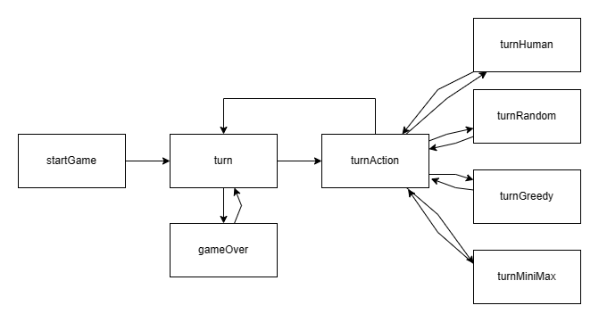

# PFL 22/23 - Trabalho Prático 2

## Identificação do trabalho

### Jogo: Barca

### Grupo: (Barca_2)

- 202005358 - Alexandre Ferreira Nunes
- 202004907 - Gonçalo da Costa Sequeira Pinto
- 202005285 - Guilherme António Cerqueira Magalhães

## Instalação e Execução

## Descrição do jogo

## Lógica do jogo

### Representação interna do estado do jogo

O estado do jogo é representado `dinamicamente` com os seguintes 3 predicados:

```prolog
playerType/2
board/1
playerTurn/1
```

- `playerType(+Player, -Type)`:

Indica o tipo do jogador.

Os jogadores são representados por:

0. Player 1
1. Player 2

Os tipos podem ser:

0. Human
1. Random Bot
2. Greedy Bot
3. MinMax Bot

Exemplos de uso:

```
playerType(0, 0) % O player 1 é human?
playerType(1, 2) % O player 2 é greedy?
```

Este predicado é utilizado para possibilitar uma interface de turnos generalizada e consistente.

---

- `board(-Board)`:

Unifica a variável Board com o tabuleiro atual do jogo.

O tabuleiro é representado como uma lista de listas.

Exemplo de um tabuleiro:

```prolog
[
    [0, 0, 0, 0, 4, 4, 0, 0, 0, 0],
    [0, 0, 0, 6, 5, 5, 6, 0, 0, 0],
    [0, 0, 0, 0, 0, 0, 0, 0, 0, 0],
    [0, 0, 0, 7, 0, 0, 7, 0, 0, 0],
    [0, 0, 0, 0, 0, 0, 0, 0, 0, 0],
    [0, 0, 0, 0, 0, 0, 0, 0, 0, 0],
    [0, 0, 0, 7, 0, 0, 7, 0, 0, 0],
    [0, 0, 0, 0, 0, 0, 0, 0, 0, 0],
    [0, 0, 0, 3, 2, 2, 3, 0, 0, 0],
    [0, 0, 0, 0, 1, 1, 0, 0, 0, 0]
].
```

Os possíveis valores em cada átomo do tabuleiro são:

0. No Piece
1. Elephant (Player 1)
2. Mouse (Player 1)
3. Lion (Player 1)
4. Elephant (Player 2)
5. Mouse (Player 2)
6. Lion (Player 2)
7. Target
8. Possible Move
9. Previous Position

---

- `playerTurn(+Player)`:

Verifica se é a vez de o Player (0/1) jogar.

### Visualização do estado de jogo

O código relacionado com a visualização do estado do jogo está no ficheiro `view.pl`.

O predicado principal é:

```prolog
drawBoard(Board) :- 
    drawHeader,
    drawRowLoop(10, Board),
    drawFooter,
    !.
```

Sendo intuitivo o funcionamento high-level.

Cada posição do tabuleiro é um quadrado 3x3, portanto o desenho de uma linha do tabuleiro corresponde a 3 linhas de output, sendo cada peça dividida em 3 partes.

Ou seja, o desenho de uma linha do tabuleiro vai ser:

```prolog
drawRow(Index, Row) :-
    drawLine(Index, Row, 1),
    drawLine(Index, Row, 2),
    drawLine(Index, Row, 3).
```

A tradução dos valores do tabuleiro para as peças é realizada no seguinte predicado:

```prolog
drawPlace(+Piece, +Offset, +Color).
```

Sendo `Piece` o valor do tabuleiro; `Offset` a parte atual da peça; `Color` cor da posição

Exemplo - Desenho do elefante:

```prolog
drawPlace(1, 1, _) :- write('()o o()|').
drawPlace(1, 2, _) :- write('  (1)  |').
drawPlace(1, _, _) :- write('  ( )  |').
drawPlace(4, 1, _) :- write('()o o()|').
drawPlace(4, 2, _) :- write('  (2)  |').
drawPlace(4, _, _) :- write('  ( )  |').
```

As peças não diferem consoante a cor mas este parâmetro permite desenhar lugares vazios de uma forma mais clara e bonita.

A cor é calculada com o Index da coluna:

```prolog
Color is Index mod 2
```

Tabuleiro inicial:

```
      A       B       C       D       E       F       G       H       I       J     
   ------- ------- ------- ------- ------- ------- ------- ------- ------- -------  
  |       | . . . |       | . . . |()o o()|()o o()|       | . . . |       | . . . |
10|       | . . . |       | . . . |  (2)  |  (2)  |       | . . . |       | . . . |10
  |       | . . . |       | . . . |  ( )  |  ( )  |       | . . . |       | . . . |
   ------- ------- ------- ------- ------- ------- ------- ------- ------- -------  
  | . . . |       | . . . | @@@@@ || o o ||| o o || @@@@@ |       | . . . |       |
 9| . . . |       | . . . |@o\2/o@| \ 2 / | \ 2 / |@o\2/o@|       | . . . |       |9
  | . . . |       | . . . | @@@@@ | -\_/- | -\_/- | @@@@@ |       | . . . |       |
   ------- ------- ------- ------- ------- ------- ------- ------- ------- -------  
  |       | . . . |       | . . . |       | . . . |       | . . . |       | . . . |
 8|       | . . . |       | . . . |       | . . . |       | . . . |       | . . . |8
  |       | . . . |       | . . . |       | . . . |       | . . . |       | . . . |
   ------- ------- ------- ------- ------- ------- ------- ------- ------- -------  
  | . . . |       | . . . |   |   | . . . |       |   |   |       | . . . |       |
 7| . . . |       | . . . | --|-- | . . . |       | --|-- |       | . . . |       |7
  | . . . |       | . . . |   |   | . . . |       |   |   |       | . . . |       |
   ------- ------- ------- ------- ------- ------- ------- ------- ------- -------  
  |       | . . . |       | . . . |       | . . . |       | . . . |       | . . . |
 6|       | . . . |       | . . . |       | . . . |       | . . . |       | . . . |6
  |       | . . . |       | . . . |       | . . . |       | . . . |       | . . . |
   ------- ------- ------- ------- ------- ------- ------- ------- ------- -------  
  | . . . |       | . . . |       | . . . |       | . . . |       | . . . |       |
 5| . . . |       | . . . |       | . . . |       | . . . |       | . . . |       |5
  | . . . |       | . . . |       | . . . |       | . . . |       | . . . |       |
   ------- ------- ------- ------- ------- ------- ------- ------- ------- -------  
  |       | . . . |       |   |   |       | . . . |   |   | . . . |       | . . . |
 4|       | . . . |       | --|-- |       | . . . | --|-- | . . . |       | . . . |4
  |       | . . . |       |   |   |       | . . . |   |   | . . . |       | . . . |
   ------- ------- ------- ------- ------- ------- ------- ------- ------- -------  
  | . . . |       | . . . |       | . . . |       | . . . |       | . . . |       |
 3| . . . |       | . . . |       | . . . |       | . . . |       | . . . |       |3
  | . . . |       | . . . |       | . . . |       | . . . |       | . . . |       |
   ------- ------- ------- ------- ------- ------- ------- ------- ------- -------  
  |       | . . . |       | @@@@@ || o o ||| o o || @@@@@ | . . . |       | . . . |
 2|       | . . . |       |@o\1/o@| \ 1 / | \ 1 / |@o\1/o@| . . . |       | . . . |2
  |       | . . . |       | @@@@@ | -\_/- | -\_/- | @@@@@ | . . . |       | . . . |
   ------- ------- ------- ------- ------- ------- ------- ------- ------- -------  
  | . . . |       | . . . |       |()o o()|()o o()| . . . |       | . . . |       |
 1| . . . |       | . . . |       |  (1)  |  (1)  | . . . |       | . . . |       |1
  | . . . |       | . . . |       |  ( )  |  ( )  | . . . |       | . . . |       |
   ------- ------- ------- ------- ------- ------- ------- ------- ------- -------  
      A       B       C       D       E       F       G       H       I       J     
```

```
A seguinte posição corresponde a uma casa objetivo.

 ------- 
|   |   |
| --|-- |
|   |   |
 ------- 
```

Tabuleiro durante o jogo:

```
      A       B       C       D       E       F       G       H       I       J     
   ------- ------- ------- ------- ------- ------- ------- ------- ------- -------  
  |       | . . . |       | . . . |()o o()|()o o()|       | . . . |       | . . . |
10|       | . . . |       | . . . |  (2)  |  (2)  |       | . . . |       | . . . |10
  |       | . . . |       | . . . |  ( )  |  ( )  |       | . . . |       | . . . |
   ------- ------- ------- ------- ------- ------- ------- ------- ------- -------  
  | . . . |       | . . . |       | . . . |       | @@@@@ |       | . . . |       |
 9| . . . |       | . . . |       | . . . |       |@o\2/o@|       | . . . |       |9
  | . . . |       | . . . |       | . . . |       | @@@@@ |       | . . . |       |
   ------- ------- ------- ------- ------- ------- ------- ------- ------- -------  
  |       | . . . |       | . . . || o o ||~~~~~~~|       | . . . | @@@@@ | . . . |
 8|       | . . . |       | . . . | \ 2 / |~~~~~~~|       | . . . |@o\2/o@| . . . |8
  |       | . . . |       | . . . | -\_/- |~~~~~~~|       | . . . | @@@@@ | . . . |
   ------- ------- ------- ------- ------- ------- ------- ------- ------- -------  
  | . . . |       | . . . |()o o()| . . . |       | @@@@@ |       | . . . |       |
 7| . . . |       | . . . |  (1)  | . . . |       |@o\1/o@|       | . . . |       |7
  | . . . |       | . . . |  ( )  | . . . |       | @@@@@ |       | . . . |       |
   ------- ------- ------- ------- ------- ------- ------- ------- ------- -------  
  |       | . . . |       | . . . |       | . . . |       | . . . |       | . . . |
 6|       | . . . |       | . . . |       | . . . |       | . . . |       | . . . |6
  |       | . . . |       | . . . |       | . . . |       | . . . |       | . . . |
   ------- ------- ------- ------- ------- ------- ------- ------- ------- -------  
  | . . . |       | . . . |       | . . . |       | . . . |       | . . . |       |
 5| . . . |       | . . . |       | . . . |       | . . . |       | . . . |       |5
  | . . . |       | . . . |       | . . . |       | . . . |       | . . . |       |
   ------- ------- ------- ------- ------- ------- ------- ------- ------- -------  
  |       | . . . |       || o o ||       | . . . |   |   | . . . |       | . . . |
 4|       | . . . |       | \ 2 / |       | . . . | --|-- | . . . |       | . . . |4
  |       | . . . |       | -\_/- |       | . . . |   |   | . . . |       | . . . |
   ------- ------- ------- ------- ------- ------- ------- ------- ------- -------  
  | . . . |       | . . . |       | . . . |       | . . . |       | . . . |       |
 3| . . . |       | . . . |       | . . . |       | . . . |       | . . . |       |3
  | . . . |       | . . . |       | . . . |       | . . . |       | . . . |       |
   ------- ------- ------- ------- ------- ------- ------- ------- ------- -------  
  || o o || . . . |       | . . . |       || o o ||       | . . . |       | . . . |
 2| \ 1 / | . . . |       | . . . |       | \ 1 / |       | . . . |       | . . . |2
  | -\_/- | . . . |       | . . . |       | -\_/- |       | . . . |       | . . . |
   ------- ------- ------- ------- ------- ------- ------- ------- ------- -------  
  | . . . |       |()o o()|       | . . . |       | . . . | @@@@@ | . . . |       |
 1| . . . |       |  (1)  |       | . . . |       | . . . |@o\1/o@| . . . |       |1
  | . . . |       |  ( )  |       | . . . |       | . . . | @@@@@ | . . . |       |
   ------- ------- ------- ------- ------- ------- ------- ------- ------- -------  
      A       B       C       D       E       F       G       H       I       J     
```

```
A seguinte posição corresponde à posição anterior da peça que se moveu mais recentemente.

Torna mais claro qual a peça que se mexeu no turno.

 ------- 
|~~~~~~~|
|~~~~~~~|
|~~~~~~~|
 ------- 
```

Também implementamos uma feature de permite o jogador observar os possíveis movimentos que pode realizar depois de selecionar uma peça. Permite que o utilizador observe movimentos inválidos que possam não ser obvios.

Exemplo complexo de movimentos do elefante na posição `E6`:

```
      A       B       C       D       E       F       G       H       I       J     
   ------- ------- ------- ------- ------- ------- ------- ------- ------- -------  
  |XXXXXXX| . . . |       | . . . |XXXXXXX|()o o()|       | . . . |XXXXXXX| . . . |
10|XXXXXXX| . . . |       | . . . |XXXXXXX|  (1)  |       | . . . |XXXXXXX| . . . |10
  |XXXXXXX| . . . |       | . . . |XXXXXXX|  ( )  |       | . . . |XXXXXXX| . . . |
   ------- ------- ------- ------- ------- ------- ------- ------- ------- -------  
  | . . . |XXXXXXX| . . . | @@@@@ |XXXXXXX|       | . . . |XXXXXXX| . . . |       |
 9| . . . |XXXXXXX| . . . |@o\1/o@|XXXXXXX|       | . . . |XXXXXXX| . . . |       |9
  | . . . |XXXXXXX| . . . | @@@@@ |XXXXXXX|       | . . . |XXXXXXX| . . . |       |
   ------- ------- ------- ------- ------- ------- ------- ------- ------- -------  
  |       | . . . |XXXXXXX| . . . |XXXXXXX|| o o ||       | . . . |       | . . . |
 8|       | . . . |XXXXXXX| . . . |XXXXXXX| \ 1 / |       | . . . |       | . . . |8
  |       | . . . |XXXXXXX| . . . |XXXXXXX| -\_/- |       | . . . |       | . . . |
   ------- ------- ------- ------- ------- ------- ------- ------- ------- -------  
  | . . . |       | . . . |   |   | . . . |       || o o ||       | . . . |       |
 7| . . . |       | . . . | --|-- | . . . |       | \ 2 / |       | . . . |       |7
  | . . . |       | . . . |   |   | . . . |       | -\_/- |       | . . . |       |
   ------- ------- ------- ------- ------- ------- ------- ------- ------- -------  
  |       | . . . |       || o o ||()o o()| . . . |       | . . . |XXXXXXX|XXXXXXX|
 6|       | . . . |       | \ 2 / |  (1)  | . . . |       | . . . |XXXXXXX|XXXXXXX|6
  |       | . . . |       | -\_/- |  ( )  | . . . |       | . . . |XXXXXXX|XXXXXXX|
   ------- ------- ------- ------- ------- ------- ------- ------- ------- -------  
  | . . . |       | . . . |       | . . . |XXXXXXX| . . . |       | . . . |       |
 5| . . . |       | . . . |       | . . . |XXXXXXX| . . . |       | . . . |       |5
  | . . . |       | . . . |       | . . . |XXXXXXX| . . . |       | . . . |       |
   ------- ------- ------- ------- ------- ------- ------- ------- ------- -------  
  |       |()o o()|XXXXXXX| @@@@@ |XXXXXXX| . . . || o o || . . . |       | . . . |
 4|       |  (2)  |XXXXXXX|@o\1/o@|XXXXXXX| . . . | \ 1 / | . . . |       | . . . |4
  |       |  ( )  |XXXXXXX| @@@@@ |XXXXXXX| . . . | -\_/- | . . . |       | . . . |
   ------- ------- ------- ------- ------- ------- ------- ------- ------- -------  
  | . . . |XXXXXXX| . . . |       | @@@@@ |       | . . . |       | . . . |       |
 3| . . . |XXXXXXX| . . . |       |@o\2/o@|       | . . . |       | . . . |       |3
  | . . . |XXXXXXX| . . . |       | @@@@@ |       | . . . |       | . . . |       |
   ------- ------- ------- ------- ------- ------- ------- ------- ------- -------  
  |XXXXXXX| . . . |       | . . . |       | . . . | @@@@@ | . . . |       | . . . |
 2|XXXXXXX| . . . |       | . . . |       | . . . |@o\2/o@| . . . |       | . . . |2
  |XXXXXXX| . . . |       | . . . |       | . . . | @@@@@ | . . . |       | . . . |
   ------- ------- ------- ------- ------- ------- ------- ------- ------- -------  
  | . . . |       | . . . |       | . . . |()o o()| . . . |       | . . . |       |
 1| . . . |       | . . . |       | . . . |  (2)  | . . . |       | . . . |       |1
  | . . . |       | . . . |       | . . . |  ( )  | . . . |       | . . . |       |
   ------- ------- ------- ------- ------- ------- ------- ------- ------- -------  
      A       B       C       D       E       F       G       H       I       J     
```

```
A seguinte posição corresponde a uma jogada VÁLIDA.

 ------- 
|XXXXXXX|
|XXXXXXX|
|XXXXXXX|
 ------- 
```

### Execução de Jogadas

A imagem seguinte permite ver um diagrama com a estrutura high level do algoritmo de execução das jogadas.

<div align="center">
    
</div>

Analisando primeiramente o predicado startGame:

```prolog
startGame :-
    get_initial_board(InitialBoard),
    setBoard(InitialBoard),
    switchPlayer, % Turno do player 1
    !,
    repeat,
    board(B), % Vai buscar o tabuleiro armazenado dinamicamente
    drawBoard(B), % Desenha o tabuleiro
    playerTurn(Player), % Vai buscar o jogador que deve jogar
    removeLastPosition(B, Board), % Remove indicador de última posição (Feature referida anteriormente)
    turn(Board, Player), % Realiza o turno
    switchPlayer, % Troca a vez do jogador
    gameOver(Winner), % Verifica se acabou
    Winner < 3,
    displayWinnerMessage(Winner).
```

O predicado turn tem como propósito verificar se o jogador tem peças assustadas ou não, e chamar o predicado turn_action com as peças que o jogador é obrigado a jogar.
```prolog
% Test if player has scared pieces
% If yes, he needs to play them
turn(Board, Player) :-
    findScaredPieces(Board, Player, ScaredPieces),
    ScaredPieces  = [_|_],
    turn_action(Board, Player, ScaredPieces),
    !.
% Otherwise, play a normal turn
turn(Board, Player) :-
    validPieces(Board, Player, Pieces),
    turn_action(Board, Player, Pieces).
```

Por sua vez o turn_action irá verificar o tipo do jogador do turno e redireciona a execução para o predicado adequado:

```prolog
% If Player is Human
turn_action(Board, Player, PiecesToMove) :-
    playerType(Player, 0),
    turn_human(Board, Player, PiecesToMove).

% If Player is Random
turn_action(Board, Player, PiecesToMove) :-
    playerType(Player, 1),
    turn_random(Board, Player, PiecesToMove).

% If Player is Greedy
turn_action(Board, Player, PiecesToMove) :-
    playerType(Player, 2),
    turn_greedy(Board, Player, PiecesToMove).

% If Player is Greedy (MinMax)
turn_action(Board, Player, PiecesToMove) :-
    playerType(Player, 3),
    turn_greedy_minmax(Board, Player, PiecesToMove).
```

Por fim tem então a lógica do turno de cada jogador: turn_human, turn_random, turn_greedy, turn_minmax.

Iremos analisar o turn_human e os restantes têm uma lógica parecida:

```prolog
% Handle Human Turn
turn_human(Board, Player, PiecesToMove) :-
    readPosition(X, Y, Piece, Board, Player, PiecesToMove),
    visualize_moves(X, Y, Piece, Board, Player, Moves),
    readDestination(XF, YF, Moves, Player),
    movePiece(X, Y, XF, YF, Board, NewBoard),
    !,
    setBoard(NewBoard).
```

- `readPosition` - Irá ler do input uma posição válida
- `visualize_moves`- Irá desenhar no ecrã os movimentos válidos que o jogador pode realizar
- `readDestination` - Irá ler do input uma posição válida
- `movePiece` - Alterar o board atual
- `setBoard` - Altera o board armazenado dinamicamente

### Lista de Jogadas Válidas

A obtenção de jogadas válidas corresponde aos seguintes predicados:

TODO: ALTERAR NOMES PARA O QUE ELES QUEREM: valid_moves

```
getMoves(X, Y, P, Board, Player, Moves) :-
    mouse(P),
    expand_up_down(X, Y, Board, Player, P, Moves),
    !.
getMoves(X, Y, P, Board, Player, Moves) :-
    lion(P),
    expand_diagonal(X, Y, Board, Player, P, Moves),
    !.
getMoves(X, Y, P, Board, Player, Moves) :-
    elephant(P),
    expand_up_down(X, Y, Board, Player, P, Moves1),
    expand_diagonal(X, Y, Board, Player, P, Moves2),
    append(Moves1, Moves2, Moves),
    !.
```

De forma a tornar esta operação simples e eficiente implementou-se um `algoritmo de expansão` onde a partir de uma posição o algoritmo expande numa direção e adiciona as novas posições até encontrar o fim do tabuleiro ou alguma peça pelo meio.

Este algoritmo permite logo resolver o problema de as peças poderem passar por cima duma das outras.

#### Implementação do algoritmo de expansão:

As peças podem expandir em 8 direções.

- O predicado `expand_cross` trata das direções horizontais e verticais.
- O predicado `expand_diagonal` trata das direções na diagonal.

Ambos os predicados acima utilizam o predicado `expand`.

```prolog
expand(+X, +Y, +StepX, +StepY, +Board, +Player, +Piece, -Moves).
```

Que tem como argumentos:
- A posição atual (X,Y)
- A direção da expansão (StepX, StepY)
- O tabuleiro atual (Board)
- O Jogador da peça que está a expandir (Player)
- A peça que está a expandir (Piece)

```
É recebido o Player e a Piece para permitir calcular se a peça fica assustada com um movimento, em caso afirmativo o movimento é inválido.
```

E unifica a variável Moves com os movimentos calculados.

A implementação do predicado `expand` é simples visto e chama outro predicado com um acumulador.

```prolog
expand(X, Y, StepX, StepY, Board, Player, Piece, Moves) :-
    X1 is X + StepX,
    Y1 is Y + StepY,
    expand_acc(X1, Y1, StepX, StepY, Board, Player, Piece, [], Moves).
```

O cálculo de X1 e Y1 permite ignorar a posição atual da peça.

Por fim, o predicado `expand_acc` vai somando StepX e StepY às variáveis X e Y e verifica se o movimento é válido.

```prolog
% Verifica os limites do tabuleiro
expand_acc(0, _, _, _, _, _, _, Acc, Acc).
expand_acc(11, _, _, _, _, _, _, Acc, Acc).
expand_acc(_, 0, _, _, _, _, _, Acc, Acc).
expand_acc(_, 11, _, _, _, _, _, Acc, Acc).

% Verifica se a posição está ocupada
expand_acc(X, Y, _, _, Board, _, _, Acc, Acc) :-
    getPiece(X, Y, Board, Piece),
    \+empty(Piece).

% Verifica se o movimento torna a peça assutada
expand_acc(X, Y, StepX, StepY, Board, Player, Piece, Acc, Result) :-
    isScared(X, Y, Board, Player, Piece),
    X1 is X + StepX,
    Y1 is Y + StepY,
    expand_acc(X1, Y1, StepX, StepY, Board, Player, Piece, Acc, Result).

% Caso contrário, é um movimento válido
expand_acc(X, Y, StepX, StepY, Board, Player, Piece, Acc, Result) :-
    A1 = [X-Y|Acc],
    X1 is X + StepX,
    Y1 is Y + StepY,
    expand_acc(X1, Y1, StepX, StepY, Board, Player, Piece, A1, Result).
```

### Final do Jogo

### Avaliação do Tabuleiro

Existe dois predicados de avaliação do tabuleiro.

No início de cada jogo é pedido ao utilizador para indicar o tipo de evaluate que pretende utilizar.

<div align="center">
    
</div>

#### Avaliação "Simple"

A avaliação tem como principal fator o número de pontos que o Player tem.

Com pontos quer-se dizer com número de casas objetivo dominadas.

Além dos pontos é avaliado o número de peças assutadas que o outro jogador tem.

Esta última verificação é essencial, sem ela o bot não tentaria retirar as peças do outro jogador das casas objetivo.

```prolog
evaluate(Board, Player, Value) :-
    getTargetPieces(Board, TargetPieces),
    getPlayerPoints(TargetPieces, Player, 0, Points),
    OtherPlayer is 1 - Player,
    findScaredPieces(Board, OtherPlayer, ScaredOtherPlayer),
    length(ScaredOtherPlayer, NumScaredOtherPlayer),
    % Formula
    Value is -100 * Points - NumScaredOtherPlayer.
```

#### Avaliação "Complex" - Código no ficheiro AI.pl

A avaliação continua a ter em consideração o número de pontos do player (apesar de ser calculada de outra forma) e o número de peças do outro player assustadas que é essencial para uma boa jogabilidade.

O que difere é a introdução de outro fator que corresponde a uma avaliação das posições atuais das peças do tabuleiro.

As posições do tabuleiro serão divididas por zonas para cada peça, onde cada zona equivale a um valor.

Zonas do elefante: (ignorar peças no background)

<div align="center">
    
</div>

Zonas do rato: (ignorar peças no background)

IMG

Zonas do leão: (ignorar peças no background)

IMG

Cada zona equivale a um certo valor:

- A cor `roxa` corresponde ao objetivos e equivale ao valor 10000.
- A cor `vermelha` equivale ao valor 40.
- A cor `laranja` equivale ao valor 30.
- A cor `amarela` equivale ao valor 20.
- A cor `verde` equivale ao valor 10.

No entanto, apenas com estes diagramas o desempenho dos bots ainda não é bom o suficiente, visto que eles podem ir para a beira de objetivos já ocupados quando deveriam ir para os objetivos vazios.

Então é realizado uma verificação por quadrante.

Caso o objetivo do quadrante estiver ocupado, o valor das posições desse quadrante valem `metade`.

Pode-se observar abaixo duas imagens onde a primeira corresponde aos pontos do elefante com os objetivos todos vazios, e a segunda corresponde aos pontos do elefante com o objeito do 2º quadrante ocupado.

<div align="center">
    
</div>

<div align="center">
    
</div>

No `Prolog`, pode-se obter o tabuleiro com os pontos duma peça com os seguintes predicados:

```prolog
test_evaluate_elephant.
test_evaluate_mouse.
test_evaluate_lion.
```

### Jogada do Computador

...

...

...

...


```prolog
% Handle Random Turn
turn_random(Board, Player, PiecesToMove) :-
    random_member(X-Y-Piece, PiecesToMove),
    getMoves(X, Y, Piece, Board, Player, ValidMoves),
    random_member(XF-YF, ValidMoves),
    movePiece(X, Y, XF, YF, Board, NewBoard),
    !,
    setBoard(NewBoard).

% Handle Greedy Turn
turn_greedy(Board, Player, Pieces) :-
    generateBoards(Board, Player, Pieces, [], NewBoards),
    evaluateBoards(NewBoards, Player, BoardsEvaluated),
    sort(BoardsEvaluated, SortedBoards),
    nth1(1, SortedBoards, V-_),
    getBestBoards(SortedBoards, V, BestBoards),
    !,
    random_member(MoveChosen, BestBoards),
    setBoard(MoveChosen).

% Handle MinMax Turn
turn_greedy_minmax(Board, Player, Pieces) :-
    generateBoards(Board, Player, Pieces, [], Lv1),
    generateLevel2(Lv1, Player, Lv2),
    evaluateLevel2(Lv2, Player, BestBoard, 99, Res),
    !,
    setBoard(Res).
```

## Conclusões

## Bibliografia

https://boardgamegeek.com/boardgame/69347/barca

https://en.wikipedia.org/wiki/Barca_(board_game)